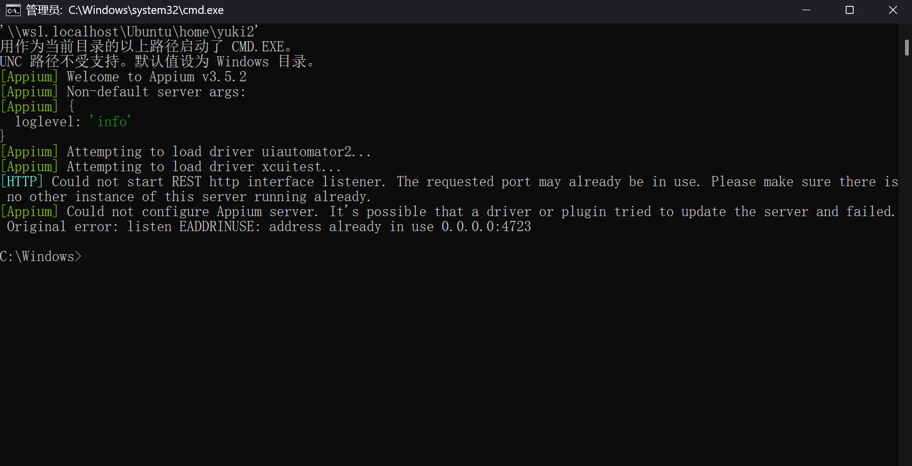
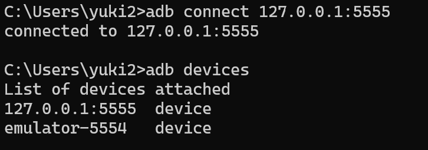
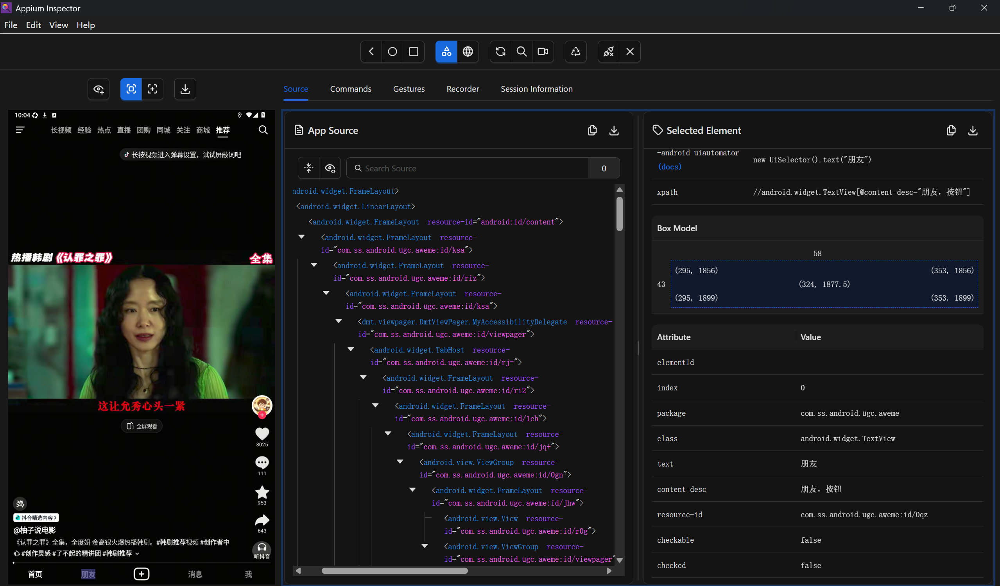
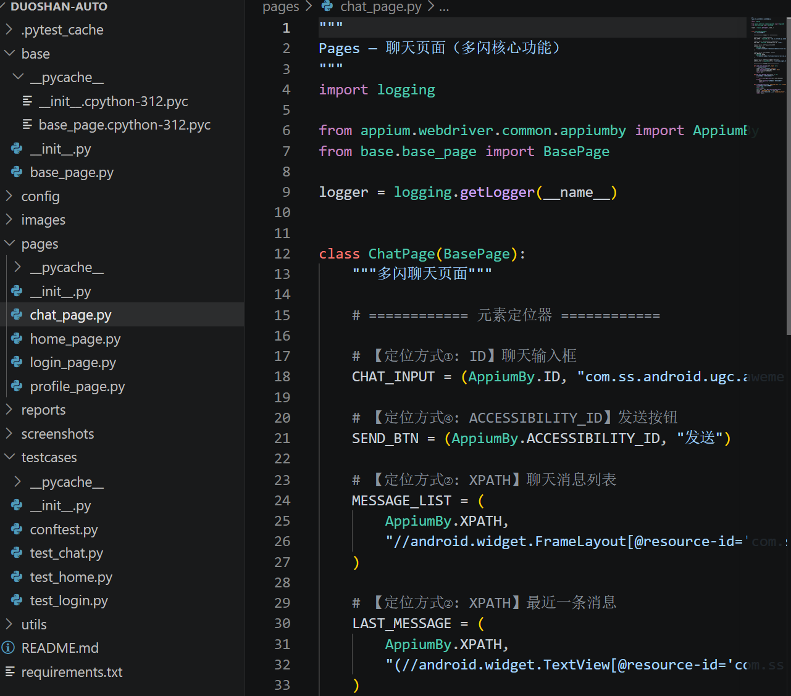
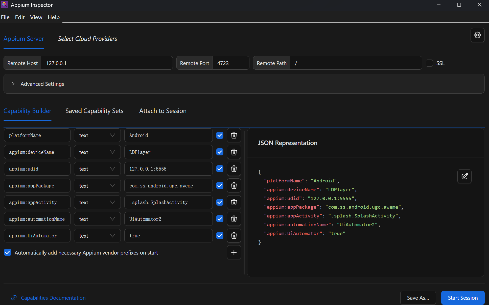
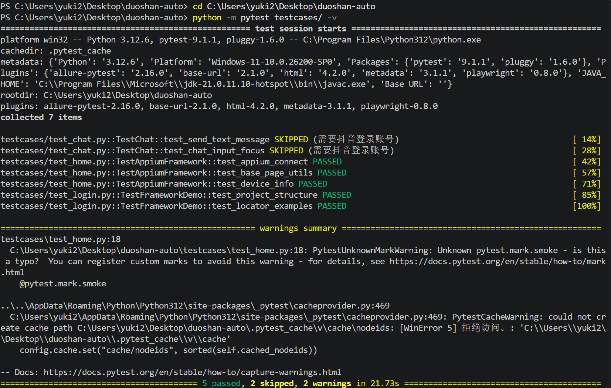
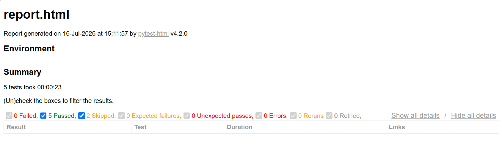

# 《Appium App 自动化》使用分享

> **项目：** 抖音 App 自动化测试  
> **语言：** Python | **框架：** Appium + pytest | **模式：** PO 三层架构

---

## 一、环境准备

### 下载地址 / 安装方式

| 组件 | 版本要求 | 下载/安装方式 |
|------|---------|--------------|
| JDK | 8 或以上 | [Oracle 官网](https://www.oracle.com/java/technologies/downloads/) 下载安装 |
| Android SDK | API 30+ | 安装 [Android Studio](https://developer.android.com/studio) 时自带 |
| Appium Server | 2.x | `npm install -g appium` |
| Appium Inspector | 最新 | [GitHub Releases](https://github.com/appium/appium-inspector/releases) 下载 exe 安装 |
| Python | 3.8+ | [python.org](https://www.python.org/) 下载安装 |
| 雷电模拟器 | 9.0+ | [ldmnq.com](https://www.ldmnq.com/) 下载安装 |

### 详细安装步骤

**第 1 步：安装 Appium Server**

```bash
# 通过 npm 全局安装
npm install -g appium

# 安装完成后查看版本
appium --version
# 输出示例: 3.5.2

# 安装 Android 自动化驱动
appium driver install uiautomator2
```

> ⚠️ 如果 npm 安装慢，可以设置国内镜像：`npm config set registry https://registry.npmmirror.com`

**第 2 步：安装 Python 依赖**

```bash
pip install appium-python-client pytest allure-pytest pytest-html
```

**第 3 步：启动 Appium Server**

```bash
appium --log-level info
```

启动成功会显示：

```
[Appium] Welcome to Appium v3.5.2
[Appium] Appium RESTful http server started on 0.0.0.0:4723
```



**第 4 步：连接雷电模拟器**

```bash
# 启动雷电模拟器后，连接 ADB
adb connect 127.0.0.1:5555

# 确认设备已连接
adb devices
```

成功输出：

```
List of devices attached
127.0.0.1:5555    device
```



> 💡 雷电模拟器默认 ADB 端口是 5555，如果连不上，可以在模拟器设置 → 其他设置中开启 ADB 调试。

---

## 二、核心功能演示

### 2.1 元素定位（5 种方式）

Appium 支持多种元素定位策略，本项目完整演示了全部 5 种。

**操作步骤：** 打开 Appium Inspector → 配置连接参数 → 点 Start Session → 在左侧手机屏幕点击元素 → 右侧属性面板查看 resource-id / class / content-desc。



**① ID 定位（推荐，最快）**

通过元素的 `resource-id` 属性定位，唯一且稳定。

```python
# AppiumBy.ID 方式
PUBLISH_BTN = (AppiumBy.ID, "com.ss.android.ugc.aweme:id/f=q")

# 使用
home_page.click(PUBLISH_BTN)
```

**② XPath 定位（最灵活）**

支持文本匹配、层级关系、模糊匹配，几乎能定位任何元素。

```python
# 按文本精确匹配
TAB_HOME = (AppiumBy.XPATH, "//android.widget.TextView[@text='首页']")

# 按文本模糊匹配（contains）
LIKE_BTN = (AppiumBy.XPATH, "//*[contains(@text, '点赞')]")

# 层级定位
ITEM = (AppiumBy.XPATH, "//*[@resource-id='xxx']//*[@class='TextView']")
```

**③ ClassName 定位**

按 Android 控件类型定位，适合批量获取同类型元素。

```python
# 获取页面中所有图片
images = driver.find_elements(AppiumBy.CLASS_NAME, "android.widget.ImageView")

# 获取所有输入框
PASSWORD_INPUT = (AppiumBy.CLASS_NAME, "android.widget.EditText")
```

**④ Accessibility ID 定位**

通过 `content-desc` 属性定位，语义清晰，性能好。

```python
# content-desc 的值
TAB_HOME = (AppiumBy.ACCESSIBILITY_ID, "首页，按钮")
TAB_FRIEND = (AppiumBy.ACCESSIBILITY_ID, "朋友，按钮")
TAB_MESSAGE = (AppiumBy.ACCESSIBILITY_ID, "消息，按钮")
TAB_PROFILE = (AppiumBy.ACCESSIBILITY_ID, "我，按钮")
```

**⑤ Android UIAutomator 定位（最强大）**

支持滚动查找等高级功能，适合列表中的元素。

```python
# 滚动到包含指定文本的元素
def scroll_to_text(self, text: str):
    ui_selector = (
        'new UiScrollable(new UiSelector().scrollable(true))'
        f'.scrollIntoView(new UiSelector().text("{text}"))'
    )
    return self.find_element((AppiumBy.ANDROID_UIAUTOMATOR, ui_selector))

# 使用示例：滚动到"退出登录"按钮
self.scroll_to_text("退出登录")
```

> **选择建议：** ID > Accessibility ID > XPath > UIAutomator > ClassName

---

### 2.2 等待机制

解决 App 页面加载慢、元素未出现时脚本报错的问题。

**操作步骤：** BasePage 初始化时设置隐式等待，在关键操作（如查找元素、点击）前加显式等待。

**代码示例：**

```python
# 隐式等待 —— 全局生效，每次 find_element 最多等 N 秒
self.driver.implicitly_wait(10)

# 显式等待 —— 针对单个元素，等待条件更丰富

# 等待元素可见（DOM 存在且显示在屏幕上）
WebDriverWait(self.driver, 15).until(
    EC.visibility_of_element_located(locator)
)

# 等待元素可点击（可见且可用）
WebDriverWait(self.driver, 15).until(
    EC.element_to_be_clickable(locator)
)

# 等待元素消失（弹窗关闭等场景）
WebDriverWait(self.driver, 15).until(
    EC.invisibility_of_element_located(locator)
)
```

**实际使用场景：**

```python
# 场景一：登录后等待首页加载（最长等 30 秒）
result = login_page.wait_element_visible(HOME_FEED, timeout=30)

# 场景二：点发送前确认按钮可点击
send_btn = wait_element_clickable(SEND_BTN)
send_btn.click()

# 场景三：等加载弹窗消失后再操作
wait_element_disappear(LOADING_DIALOG)
print("弹窗已关闭")
```

| 对比 | 隐式等待 | 显式等待 |
|------|---------|---------|
| 生效范围 | 全局所有 find 操作 | 指定的单个元素 |
| 条件类型 | 只有"元素存在" | 可见、可点击、消失等多种 |
| 灵活度 | 低 | 高 |
| 推荐场景 | 快速脚本 | 正式项目 ✅ |

---

### 2.3 手势操作

抖音是短视频 App，上下滑动是核心交互。Appium 提供了 `swipe` 方法模拟滑动手势。

**操作步骤：** 获取屏幕尺寸 → 计算起始和终点坐标 → 调用 swipe 方法。

**代码示例：**

```python
# 上滑（浏览下一条视频）
def swipe_up(self, duration=500):
    size = self.driver.get_window_size()
    start_x = size["width"] * 0.5      # 屏幕水平居中
    start_y = size["height"] * 0.8     # 从底部 80% 处开始
    end_y = size["height"] * 0.2       # 到顶部 20% 处结束
    self.driver.swipe(start_x, start_y, start_x, end_y, duration)

# 下滑（返回上一条视频）
def swipe_down(self, duration=500):
    size = self.driver.get_window_size()
    start_x = size["width"] * 0.5
    start_y = size["height"] * 0.2     # 从顶部 20% 处开始
    end_y = size["height"] * 0.8       # 到底部 80% 处结束
    self.driver.swipe(start_x, start_y, start_x, end_y, duration)

# 批量滑动浏览 Feed 流
def browse_feed(self, swipe_count=5):
    for i in range(swipe_count):
        self.swipe_up()
        print(f"已滑动第 {i+1} 次")
        time.sleep(1)  # 每次滑动间隔，等待视频加载
```

---

### 2.4 PO 三层模型

Page Object Model（页面对象模型）是 UI 自动化的核心设计模式，将代码分为三层，各司其职。

**操作步骤：** 先写 BasePage 封装通用方法 → 再写 Pages 定义元素和业务操作 → 最后写 TestCase 编排测试用例。



**第一层：BasePage（基类）**

封装所有页面通用的底层操作，如点击、输入、等待、截图等。

```python
class BasePage:
    """所有页面对象的基类"""

    def __init__(self, driver):
        self.driver = driver
        self.driver.implicitly_wait(10)

    # ---------- 元素定位 ----------
    def find_element(self, locator):
        return self.driver.find_element(*locator)

    # ---------- 等待 ----------
    def wait_element_visible(self, locator, timeout=15):
        return WebDriverWait(self.driver, timeout).until(
            EC.visibility_of_element_located(locator)
        )

    # ---------- 操作 ----------
    def click(self, locator):
        el = self.wait_element_clickable(locator)
        el.click()

    def input_text(self, locator, text):
        el = self.wait_element_visible(locator)
        el.clear()
        el.send_keys(text)

    # ---------- 截图 ----------
    def take_screenshot(self, name=None):
        timestamp = datetime.now().strftime("%Y%m%d_%H%M%S")
        path = f"screenshots/{name}_{timestamp}.png"
        self.driver.save_screenshot(path)
        return path

    # ---------- 手势 ----------
    def swipe_up(self):
        size = self.driver.get_window_size()
        self.driver.swipe(size["width"]*0.5, size["height"]*0.8,
                          size["width"]*0.5, size["height"]*0.2)
```

**第二层：Pages（页面对象）**

每个页面一个类，定义该页面的元素定位器和业务操作方法。

```python
class LoginPage(BasePage):
    """抖音登录页面"""

    # 元素定位器（集中管理）
    PHONE_INPUT = (AppiumBy.ID, "com.ss.android.ugc.aweme:id/lhb")
    PASSWORD_INPUT = (AppiumBy.ID, "com.ss.android.ugc.aweme:id/lc0")
    LOGIN_BTN = (AppiumBy.ID, "com.ss.android.ugc.aweme:id/login")
    PASSWORD_LINK = (AppiumBy.ID, "com.ss.android.ugc.aweme:id/jm4")

    # 业务方法（return self 支持链式调用）
    def input_phone(self, phone):
        self.input_text(self.PHONE_INPUT, phone)
        return self

    def input_password(self, pwd):
        self.input_text(self.PASSWORD_INPUT, pwd)
        return self

    def click_login(self):
        self.click(self.LOGIN_BTN)
        return self

    # 组合操作
    def login_flow(self, phone, pwd):
        self.input_phone(phone).input_password(pwd).click_login()
        return self
```

> 💡 **链式调用的好处：** 代码更简洁，一行完成多个操作：`page.input_phone("138xxx").input_password("pwd").click_login()`

**第三层：TestCase（测试用例）**

只关心测试逻辑，不关心元素怎么定位。

```python
class TestLogin:

    def test_login_page_ui(self, driver):
        """验证登录页所有关键元素"""
        login_page = LoginPage(driver)

        # Assert（断言）
        assert login_page.is_element_present(login_page.PHONE_INPUT)
        assert login_page.is_element_present(login_page.PASSWORD_LINK)

        # 截图
        login_page.take_screenshot(name="登录页UI")

    def test_input_fields(self, driver):
        """验证输入框可正常输入"""
        login_page = LoginPage(driver)

        login_page.click_password_login() \
            .input_phone("13800138000") \
            .input_password("test123456")
```

> ✅ **PO 模型的核心价值：** 如果 App 的某个元素 ID 变了，只需改 Pages 层的定位器，TestCase 层完全不用动。

---

## 三、实战示例

### 项目背景

使用 Appium + Python 对 **抖音 App** 进行 UI 自动化测试，验证从环境搭建到测试运行的全流程。

### 完整操作流程

**Step 1：配置 Desired Capabilities**

在 `config/desired_caps.py` 中配置设备参数：



```python
{
    "platformName": "Android",          # 平台
    "deviceName": "LDPlayer",           # 设备名
    "udid": "127.0.0.1:5555",           # ADB 地址
    "appPackage": "com.ss.android.ugc.aweme",   # 抖音包名
    "appActivity": ".splash.SplashActivity",     # 启动页
    "noReset": True,                    # 不重置数据
    "automationName": "UiAutomator2",   # 自动化引擎
}
```

**Step 2：运行测试**

```bash
cd duoshan-auto
python -m pytest testcases/ -v
```



**Step 3：生成 HTML 报告**

```bash
python -m pytest testcases/ \
    --html=reports/report.html \
    --self-contained-html
```



### 最终结果

```
collected 7 items

test_chat.py::test_send_text_message SKIPPED   [14%]
test_chat.py::test_chat_input_focus SKIPPED     [28%]
test_home.py::test_appium_connect PASSED        [42%]
test_home.py::test_base_page_utils PASSED       [57%]
test_home.py::test_device_info PASSED           [71%]
test_login.py::test_project_structure PASSED    [85%]
test_login.py::test_locator_examples PASSED     [100%]

================= 5 passed, 2 skipped in 21.73s =================
```

| 测试用例 | 状态 | 说明 |
|---------|------|------|
| test_appium_connect | ✅ | Appium 连接 + 启动 App + 截图 |
| test_base_page_utils | ✅ | BasePage 公共方法验证 |
| test_device_info | ✅ | 获取设备信息 |
| test_project_structure | ✅ | PO 模型结构展示 |
| test_locator_examples | ✅ | 5 种定位方式演示 |
| test_chat_* | ⏩ | 需登录账号，已标记跳过 |

---

## 四、踩坑记录

| # | 问题现象 | 原因分析 | 解决办法 |
|:-:|---------|---------|---------|
| 1 | `Device xxx was not in list` | ADB 端口不对或连接断开 | `adb connect 127.0.0.1:5555` 重新连接 |
| 2 | `Could not find a driver for UiAutomator` | 未安装 uiautomator2 驱动，或名称写成了 `UiAutomator`（少个2） | `appium driver install uiautomator2`，名称用 `UiAutomator2` |
| 3 | `Could not connect to Appium server URL '/wd/hub'` | Appium 2.x 的基础路径是 `/` 不是 `/wd/hub` | Inspector 的 Remote Path 改为 `/` |
| 4 | `Unknown input method io.appium.settings/.UnicodeIME` | 模拟器不支持 `unicodeKeyboard` 参数 | 从 desired capabilities 中去掉 `unicodeKeyboard` 和 `resetKeyboard` |
| 5 | `An element could not be located` | 开屏广告/青少年模式弹窗遮挡，或页面未加载完 | 加 `time.sleep()` 等待弹窗消失，或添加关闭弹窗的代码 |
| 6 | `TypeError: missing 'options' argument` | appium-python-client 新版需要 `options` 参数 | 改用 `UiAutomator2Options()` 方式创建 driver |
| 7 | `Timed out waiting for root AccessibilityNodeInfo` | App 正在加载动画，UI 树不稳定 | 等几秒后再获取页面源码，或加重试机制 |

---

## 五、总结

### 工具优缺点

| 优点 | 缺点 |
|------|------|
| ✅ 跨平台：一套代码测 Android 和 iOS | ❌ 运行速度较慢（每次启动 App） |
| ✅ 多语言：Python / Java / JS / Ruby | ❌ 环境配置步骤较多 |
| ✅ 不侵入 App 源码，直接测 | ❌ 不支持微信小程序 |
| ✅ 社区活跃，遇到问题容易搜到答案 | ❌ 部分高级手势支持有限 |
| ✅ 可集成 CI/CD（Jenkins / GitLab） | |

### 适用场景

- **回归测试：** 每次 App 发版前，自动跑一遍核心功能，确保没引入新 bug
- **UI 巡检：** 每天定时执行，检查关键页面能否正常打开
- **跨平台测试：** 同一套用例同时覆盖 Android 和 iOS
- **持续集成：** 提交代码后自动触发测试，失败自动通知

### 不适用场景

- 图形验证码 / 短信验证码识别
- 实时性能监控（需配合 PerfDog 等工具）
- 微信小程序自动化（需用其他框架）

---

> **文档作者：** 抖音 App 自动化测试团队  
> **更新日期：** 2026 年 7 月
